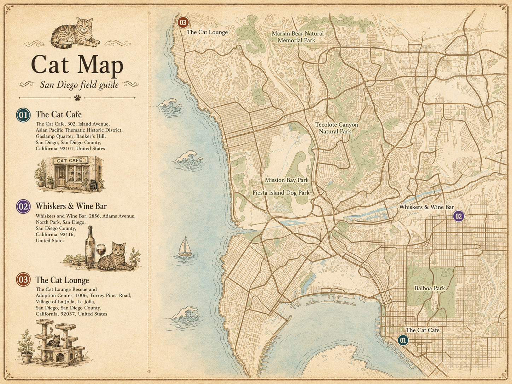

# Cat Cafe Field Guide

A personal, editorial map of cozy cat cafes and their resident cats — styled like the original vintage paper field guide, with the smallest possible product upgrade:

```text
Map -> Cat Cafe -> Cats
```

Not a review platform. Not a social app. Just a friend who takes cat cafe notes very seriously made you a guide.

## Project Goal

This project intentionally stays close to the original field guide prototype:

- Same Vite + React + TypeScript + Tailwind stack
- Same static publishing workflow
- Same dev-only admin mode
- Same JSON-file content model
- Same `public/photos/` image storage
- Same paper guide visual language

The only product-level change is the data hierarchy:

```text
Original: Map -> Coffee Shops
This version: Map -> Cat Cafes -> Cats
```

## Quick Start

```bash
npm install
npm run dev
```

Open `http://localhost:5173/?admin=true` to edit locally.

Edits write to:

```text
src/data/cafes.json
public/photos/*.jpg
```

Commit those files to publish the updated guide.

## Deploy

Push to GitHub and import the repo in [Vercel](https://vercel.com/new). It is a static Vite build with no database, no auth provider, and no environment variables.

Repository:

```text
https://github.com/fv6zp84ngy-hue/Cat-Cafe-Field-Guide.git
```

## How It Works

```text
You (locally, admin mode)            Public visitors (deployed site)
─────────────────────────            ──────────────────────────────
npm run dev                          Read-only static site
?admin=true                          No admin code in bundle
Edit cafes / cats / photos           No backend, no database
↓                                    ↓
src/data/cafes.json                  What you committed = what they see
public/photos/*.jpg
↓
git commit && git push
↓
Vercel auto-deploys
```

## GIS + GPT Map Workflow

The map is produced offline, then committed as static image assets. There is no realtime map API in the frontend.

```text
Place names
↓
npm run create:cafes
↓
map-creator resolves POI / GIS coordinates
↓
npm run import:pois
↓
npm run generate:pins
↓
GPT Image styles the map poster
↓
public/map_north.png
public/map_south.png
public/Cover.png
↓
Admin mode lets the maintainer manually adjust pins
```

Current rendered map state:



Core commands:

```bash
npm run create:cafes -- --city "San Diego" --places "The Cat Cafe" "Whiskers & Wine Bar" "The Cat Lounge"
npm run import:pois -- --poi-json /path/to/map-creator-pois.json
npm run generate:pins -- --dry-run
npm run generate:pins
npm run build
```

Map styling prompts and QA rules live in [docs/GPT_IMAGE_POSTER.md](docs/GPT_IMAGE_POSTER.md). The full POI and pin workflow lives in [docs/MAP_PIPELINE.md](docs/MAP_PIPELINE.md).

## Project Structure

```text
src/
├── components/
│   ├── Book/            # Magazine page-flip container
│   ├── CoverPage/       # Title spread
│   ├── CardVariants/    # Cat cafe card layouts
│   ├── CatCard/         # Resident cat card
│   ├── AdminPanel/      # Edit modal (dev-only)
│   └── Demo/            # ?demo=true preview mode
├── data/
│   ├── cafes.json       # Cat cafe + cat data lives here
│   ├── cafes.ts         # Loads from cafes.json
│   ├── storage.ts       # localStorage + dev-server sync
│   ├── config.ts        # Site-level config
│   └── types.ts         # CatCafe / CatProfile interfaces
└── styles/
    └── globals.css
```

## URL Modes

| URL | What it does |
| --- | --- |
| `/` | Public read-only view |
| `/?demo=true` | Layout/style preview gallery |
| `/?backdrop=cream` | Switch backdrop (`dark` \| `desk` \| `cream`) |
| `/?admin=true` *(dev only)* | Edit mode under `npm run dev` |

## Non-Goals

This project intentionally does not include:

- Database
- Login
- Real backend
- Multi-user comments
- Realtime map API
- Complex permissions
- Online editing
- Map image upload in admin mode

Map images stay in `public/map_north.png` and `public/map_south.png`, matching the original project.

## Docs

- [PRD](docs/PRD.md)
- [Step-by-step spec](docs/SPEC.md)
- [Design document](docs/DESIGN.md)
- [map-creator POI import pipeline](docs/MAP_PIPELINE.md)
- [GPT Image map poster prompts](docs/GPT_IMAGE_POSTER.md)

## Tech

Vite · React · TypeScript · Tailwind · Vercel

## License

MIT — see [LICENSE](./LICENSE).
